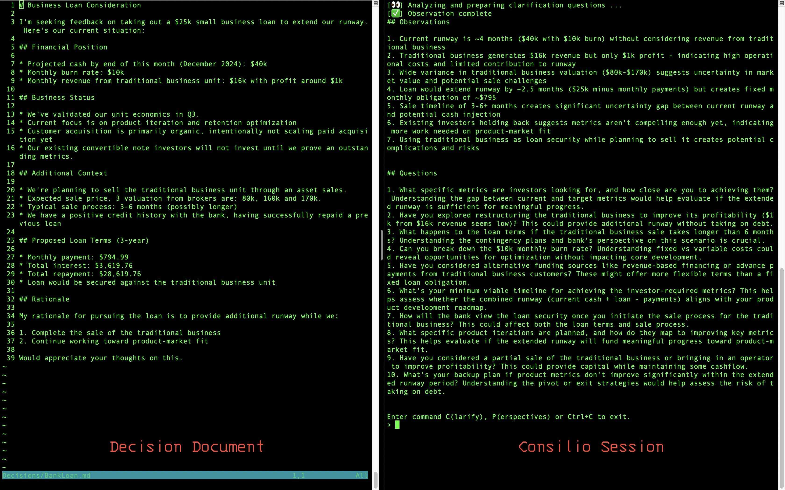

# Consilio: AI assistant for Type-1 Decisions

> "Consilio" is a Latin term that embodies concepts such as counsel,
> deliberation, and wisdom. In ancient times, "consilium" referred to a group
> of advisors or a council that deliberated on important decisions, reflecting
> a process of careful consideration and planning. The term is associated with
> strategic thinking and prudent decision-making, emphasizing the use of good
> judgment, experience, and advice.

## Overview

Consilio helps you make better decisions. It focuses on three key aspects of decision-making:

1. **Clarify**: Asking independent questions like:
   - "Have you thought about ...?"
   - "What if ...?"
   - "Let's stress test it this way ..."

   These are the kinds of questions you might expect from trusted advisors or boards.

2. **Assemble**: Gather opposing perspectives from a diverse group of angles. For example:
    - For "Early-stage VC", an opposite perspective might be "Growth-stage VC" and "Bootstrapped founder".
    - For "Mental health and wellbeing specialist", an opposite perspective might be "Personal Growth and Resilience Coach".
    
3. **Consult**: Pose detailed, targeted questions to each pair of opposing perspectives to get opinions. 

Here is a typical session where on the left on the screen, I am updating the decision document and on the right, I am interacting with Consilio.


## Decision Document

Consilio is a database free program. Every interaction is saved as 
a markdown file. Use your unix power tools to review responses and search
for discussions from past decisions.

At the center is a **Decision Document**, which captures

- The context of the decision
- The questions you need to answer
- The opinions you gather
- Any other relevant information

Think of the decision document as an Amazon 6-page memo. As you interact with
Consilio, you will refine this document by addressing the questions it poses
and giving feedback on the gathered opinions. 

Think of consilio as your pair-programming buddy who helps you write the memo.
**Tip**: Check this document into your version control system to maintain a record of your decision-making process.

## Demo Session

Following is an example session:

```bash
$ cons init

Creating configuration file at ./consilio.json

* Please describe the user role: Solo Founder
* Please describe the decision domain: a NZ-based B2C iOS app startup that are pre-product-market-fit
* Please describe the facilitator role: an bootstrapped B2C founder, who successfully navigated pre-PMF phase with limited capital. Living outside of US with the main market as US.

Consilio is ready to help you make better decisions. You can edit the ./consilio.json file to update the configuration.

Next steps:
- `cons discuss` - Select an individual perspective to interview.
- `cons meeting` - Refresh the perspective pairs.
- `cons debate` - Pose detailed, targeted questions to all perspectives.


$ cons edit
Opening ./consilio.md in your $EDITOR
...


$ cons perspectives 
* Please specify the number of perspectives: 5

Defining Perspectives ...

1. The Skeptical Investor (Risk-Averse & Bottom-Line Focused)
2. The Competitor's Advocate (Competitive Analysis & Differentiation Focused)
3. The Customer-Centric Advisor (Market Validation & User Focus)
4. The "Future of the Space" Visionary (Long-Term Growth Potential)
5. The "Devil's Advocate" (Every Assumption Challenged)


$ cons clarify
Available perspective pairs:
1. The Skeptical Investor (Risk-Averse & Bottom-Line Focused)
2. The Competitor's Advocate (Competitive Analysis & Differentiation Focused)
3. The Customer-Centric Advisor (Market Validation & User Focus)
4. The "Future of the Space" Visionary (Long-Term Growth Potential)
5. The "Devil's Advocate" (Every Assumption Challenged)

Please select the perspective pair: 2
Please enter the number of questions you would like to ask: 5

Getting clarification questions for perspective pair ...

Questions:

  - Have you thought about the potential risks of this decision? 

    This question is designed to help you think about the potential downsides
    of the decision you are considering. It is important to consider the risks
    associated with any decision you make, as these risks can have a
    significant impact on the outcome of your decision.

  - What are the key metrics you would use to evaluate the success of this
    decision?

    This question is designed to help you think about the key metrics you would
    use to evaluate the success of the decision you are considering. It is
    important to have clear metrics in place to measure the impact of your
    decision and determine whether it has been successful.

  - What are the potential challenges you foresee in implementing this decision?

    This question is designed to help you think about the potential challenges
    you may face in implementing the decision you are considering. It is
    important to anticipate and plan for these challenges in order to increase
    the likelihood of success.

  - What are the potential opportunities you see in this decision?

    This question is designed to help you think about the potential
    opportunities that may arise from the decision you are considering. It is
    important to identify and capitalize on these opportunities in order to
    maximize the benefits of your decision.

  - What are the potential risks of not making this decision?

    This question is designed to help you think about the potential risks of
    not making the decision you are considering. It is important to consider
    the consequences of inaction and the risks associated with not making a
    decision in order to make an informed choice.


$ cons meeting
Please describe the meeting agenda: 

$ cons consult

Please select the perspective pair: 2
Please enter the question: What's the top risk that have not been addressed?

Consulting perspectives ...

```

## Get Started

### Install

```bash
# Using `pipx` ... 
pipx install consilio

# or, if you prefer `uv`
uv install consilio
```

### Configuration

Create a new `.consilio.yml` file in the root directory with the following
structure:

```yaml
domain:"a NZ-based B2C iOS app startup that are pre-product-market-fit"
perspective:"an bootstrapped B2C founder, who successfully navigated pre-PMF phase with limited capital. , living outside of US but your main market is US."
user_role:"Solo Founder"
```

If you don't have a `.consilio.yml` file, Consilio will create one for you
when you run the command.

If you have multiple contexts, you can create a separate context file and load it through the command line option.

```bash
consilio --context marketing.consilio.yml
```

### Paper Trail

All intermediate steps are preserved in structured format within a date-stamped
directory, creating a detailed record of the decision-making process. This
allows for both immediate reference and retrospective review of how important
decisions were made.

## Contributing Guide

Please refer to the [CONTRIBUTING.md](CONTRIBUTING.md) document for the contribution guidelines.
Please refer to the [Python.md](Python.md) document for the coding style guide.

## Sponsor

This project is sponsored by [Keepers](https://links.keepers.photos/crl9se).
Are you a parent? Do you take a lot of photos of your kids?
Then you should check out Keepers.

Keepers is a free, privacy-first iOS app that uses AI to help parents organize their family photos.
